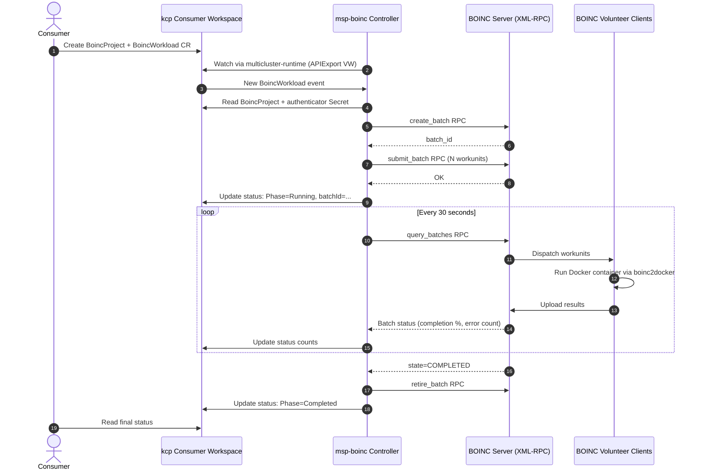
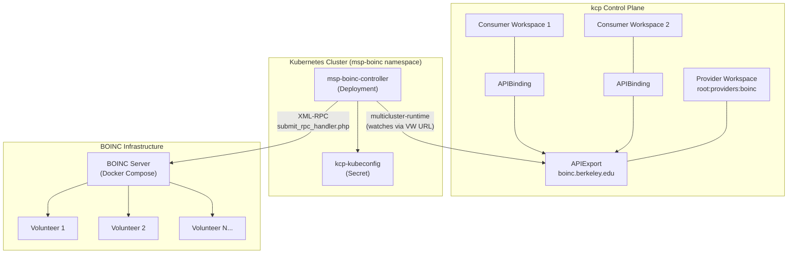

# msp-boinc Architecture

## Sync Loop — BoincWorkload Lifecycle

## Component Topology

## Key Design Decisions

1. **No downstream K8s sync.** Unlike the MongoDB MSP which syncs CRs to a downstream cluster, this controller calls BOINC's HTTP XML-RPC API directly. There is no "target cluster" — BOINC distributes work to volunteer machines.

2. **Polling-based status sync.** BOINC has no webhook/callback mechanism. The controller uses `RequeueAfter: 30s` to periodically poll `query_batches` and update the workload status in kcp.

3. **Batch-level granularity.** BOINC's remote job submission API operates at the batch level. Individual workunit details are tracked by the BOINC server but only aggregate statistics (completion %, error count) are surfaced in the CRD status.

4. **Docker workloads via boinc2docker.** Container images are run on volunteer machines via BOINC's `boinc2docker` mechanism (VirtualBox VM wrapping Docker). The controller does not deploy containers to Kubernetes.
