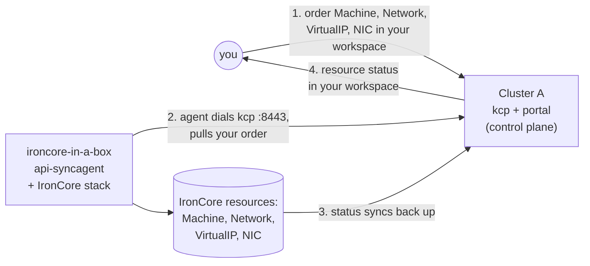

# msp-ironcore

Order IronCore compute and networking resources through Platform Mesh and watch
them provision in a local ironcore-in-a-box cluster. Uses two kind clusters:
**cluster A** is the Platform Mesh local-setup (control plane); the
**ironcore-in-a-box** cluster runs the full IronCore stack + the kcp
api-syncagent.

## How it works



You order in cluster A; the api-syncagent in the ironcore-in-a-box cluster pulls
the order down, IronCore controllers provision the resources (VM, overlay
network, virtual IP, network interface), and status syncs back to your workspace.
Full topology: [`docs/architecture.md`](docs/architecture.md).

## Prerequisites

- Docker Desktop (macOS, verified on arm64)
- `kind`, `kubectl`, `helm`, `task` (`brew install go-task`), `go`, `make`, and
  the `kubectl-ws` plugin (installed by local-setup)
- [docker-mac-net-connect](https://github.com/chipmk/docker-mac-net-connect)
  (macOS only — enables direct access to container IPs for VM connectivity)
- A checkout of the
  [helm-charts](https://github.com/platform-mesh/helm-charts) repo on the
  appropriate branch. Below, `<helm-charts>` is the absolute path to that
  checkout.

---

## 1. Stand up Cluster A (control plane)

From `<helm-charts>`:

```sh
task local-setup:example-data
```

Wait for it to be Ready:

```sh
kubectl --context kind-platform-mesh -n platform-mesh-system get platformmesh
# READY=True
```

## 2. Point at cluster A

```sh
cp ../../helm-charts/.secret/kcp/admin.kubeconfig kcp-admin.kubeconfig
export PM_KUBECONFIG="$(realpath kcp-admin.kubeconfig)"

KUBECONFIG=$PM_KUBECONFIG kubectl create-workspace ironcore-provider \
  --type=root:provider --ignore-existing \
  --server=https://kcp.api.portal.localhost:8443/clusters/root:providers

KUBECONFIG=$PM_KUBECONFIG kubectl apply \
  --server=https://kcp.api.portal.localhost:8443/clusters/root:providers:ironcore-provider \
  -f config/kcp/apiexport.yaml

KUBECONFIG=$PM_KUBECONFIG kubectl apply \
  --server=https://kcp.api.portal.localhost:8443/clusters/root:providers:ironcore-provider \
  -k config/provider
```

The api-syncagent v0.6.0 doesn't create the `APIExport` itself — it resolves
an existing one (or refuses to start). The empty `APIExport` above gets filled
in with resource schemas and permission claims when `task syncagent:publish`
applies the `PublishedResource` CRs on the ironcore-in-a-box cluster.

[`config/provider`](config/provider) is the portal-side bootstrap:
`ProviderMetadata` (listing entry — name, description, icon, contacts),
`ContentConfiguration` (adds "Machines", "Networks", "Virtual IPs",
"Network Interfaces", and "Secrets" nav nodes rendered via the default portal's
`generic-list-view` web component — no custom portal service), and RBAC that
lets account workspaces auto-bind the export.

## 3. Stand up the ironcore-in-a-box cluster (data plane)

From this directory:

```sh
task syncagent:kubeconfig syncagent:install syncagent:publish
```

Each step is idempotent — safe to re-run if anything hiccups.

## 4. Create a consumer workspace and order resources

```sh
KUBECONFIG="${PM_KUBECONFIG:-kcp-admin.kubeconfig}" \
  kubectl create-workspace consumer-ironcore --ignore-existing \
  --server=https://localhost:8443/clusters/root

task bind   CONSUMER_WS=:root:consumer-ironcore
task order  CONSUMER_WS=:root:consumer-ironcore
```

## 5. Verify

```sh
task verify CONSUMER_WS=:root:consumer-ironcore
```

Expected: **`✅ E2E PASS`**. Your Machine, Network, VirtualIP, and
NetworkInterface were synced to the ironcore-in-a-box cluster, IronCore
controllers provisioned them, and status synced back to your consumer workspace.

## 6. Clean up

```sh
task down                                  # delete ironcore-in-a-box cluster
kind delete cluster --name platform-mesh   # delete cluster A
```
