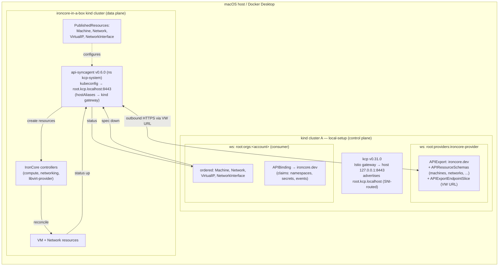

# Architecture — IronCore MSP on Platform Mesh local-setup (data plane in ironcore-in-a-box)

This variant turns **IronCore compute and networking resources** into orderable services on the
Platform Mesh **local-setup** control plane, with the **data plane in an ironcore-in-a-box kind
cluster**. A consumer creates IronCore resources (Machine, Network, VirtualIP, NetworkInterface) in
their account workspace (cluster A); the kcp **api-syncagent** — running in the ironcore-in-a-box
cluster and dialling *outbound* to A's kcp — syncs them down, where the **IronCore controllers**
provision real VMs and overlay networks. Status flows back up to the consumer. No custom operator
(IronCore-native passthrough).

## Pinned, matched stack
- **kcp v0.31.0** — provided by cluster A (local-setup); not a host binary here.
- **api-syncagent v0.6.0** (targets kcp 0.31; Helm chart `kcp/api-syncagent`) — in the
  ironcore-in-a-box cluster.
- **ironcore-in-a-box** — full IronCore stack: ironcore controllers, ironcore-net, apinetlet,
  libvirt-provider, dpservice, metalnet, metalnetlet, metalbond.

## Published Resources

| API Group | Kind | Version | Description |
|---|---|---|---|
| `compute.ironcore.dev` | Machine | v1alpha1 | Virtual machines with configurable machine classes |
| `networking.ironcore.dev` | Network | v1alpha1 | Overlay / VPC networks |
| `networking.ironcore.dev` | VirtualIP | v1alpha1 | Public virtual IPs |
| `networking.ironcore.dev` | NetworkInterface | v1alpha1 | NICs connecting machines to networks |

## Flow

## Step sequence

Cluster A (helm-charts) is stood up first: the `ironcore.dev` APIExport in
`root:providers:ironcore-provider`, portal registration, the per-account `APIBinding`, and kcp
reachable as `root.kcp.localhost:8443`. Then, in the ironcore-in-a-box cluster (this directory):

1. **Create the ironcore-in-a-box kind cluster** (shares the default `kind` Docker network with A).
2. **Install the IronCore stack** via `make up` in the ironcore-in-a-box subdirectory (deploys
   cert-manager, ironcore, ironcore-net, apinetlet, dpservice, metalnet, metalnetlet, metalbond,
   libvirt-provider).
3. **Build the provider-workspace kubeconfig** from A's admin kubeconfig (server rewritten to
   `https://root.kcp.localhost:8443/clusters/root:providers:ironcore-provider`,
   `insecure-skip-tls-verify`), store it as a `Secret` in the ironcore-in-a-box cluster
   (`kcp-system`).
4. **Install api-syncagent** v0.6.0 (Helm) into the ironcore-in-a-box cluster, pointed at the
   `ironcore.dev` APIExportEndpointSlice.
5. **Publish** the IronCore APIs via `PublishedResource` CRs (+ on-cluster RBAC). The agent
   generates `APIResourceSchema`s and fills A's `ironcore.dev` APIExport.

Then `task order` creates IronCore resources in the consumer account workspace, and `task verify`
proves the loop (resources synced down, IronCore provisions them, status synced back).

## Key design notes
- **Passthrough API**: consumers order IronCore's *native* resources — no custom operator.
- **APIExport name = `ironcore.dev`** — the integration contract with Workstream A.
  `config/syncagent/values.yaml` sets `apiExportName` + `apiExportEndpointSliceName` to it.
- **Four published resources**: Machine, Network, VirtualIP, NetworkInterface — each has its own
  `PublishedResource` CR in `config/syncagent/`.
- **Microfrontend UI**: Five portal navigation nodes (Machines, Networks, Virtual IPs, Network
  Interfaces, Secrets) using the default portal's `generic-list-view` / `generic-detail-view`.
  The Secrets view includes base64-decoded display of `ignition.yaml` data.
- **Connectivity** (the main risk): the agent in the ironcore-in-a-box cluster reaches A's kcp over
  **two hops**, both via `root.kcp.localhost:8443` — (1) the bootstrap kubeconfig server, (2) the
  `APIExportEndpointSlice` virtual-workspace URL host that A advertises. The hostname **must** be
  `root.kcp.localhost`: cluster A fronts kcp with an Istio gateway that routes by SNI and only that
  name has a TLSRoute. The **required** `hostAliases` block in `values.yaml` maps it to the shared
  `kind` network's host-gateway.
- **permissionClaims trap**: the account `APIBinding` must `Accept` all three auto-added claims —
  `namespaces`, `secrets`, `events` — or syncing silently fails.
